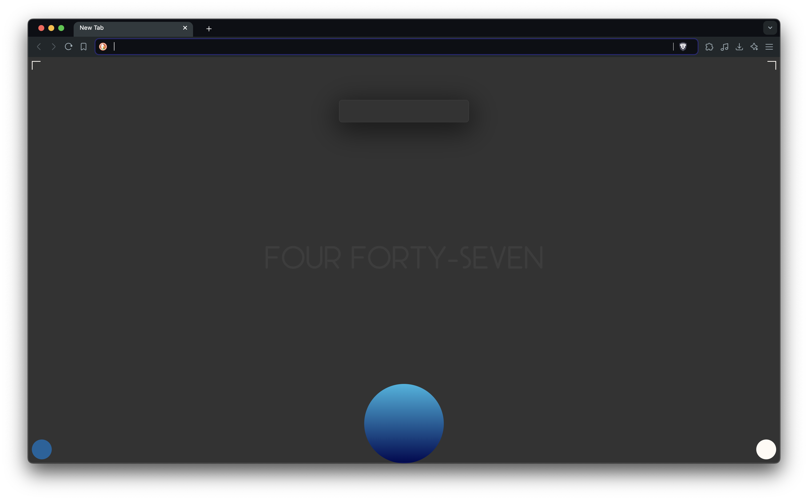

# Chrome New Tab :recycle:

This Chrome browser extension overwrites your new tab page and adds some useful shortcuts / workflows.

## Description

Started in 2019, this was my first real project in Computer Science.  I started it out as a simple time waster but I eventually added shortcuts and workflows using the Chrome API to manage tabs as well as create tab workups.  Though it is bloated and absolutely full of feature-creep and outdated functions, it is the most important project I will ever have worked on since it changed my life.

## Getting Started

### Installing
  
* Drag the zip into Chrome's extension page to load the unpacked extension.

## Authors

:key: ListenToAJ
